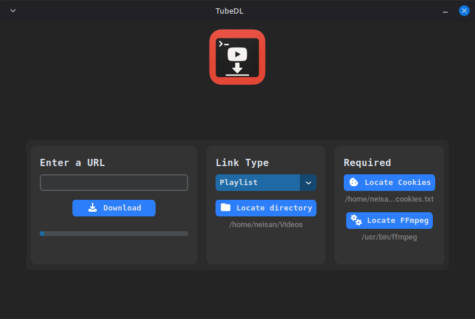

# TubeDL 🎬

A powerful YouTube video downloader with a modern dark-themed GUI, designed to download videos and playlists in the highest quality possible.

**Developed by Mister Neisan**

## ✨ Features

- 📹 **High-Quality Downloads** - Get videos in the best available quality
- 📑 **Playlist Support** - Download entire playlists with a single click
- 🎨 **Modern Dark UI** - Built with CustomTkinter for a sleek interface
- 🔄 **Real-Time Progress** - Track your download progress live
- 🍪 **Cookie Authentication** - Bypass age restrictions and access private content
- 🎞️ **FFmpeg Integration** - Automatic video/audio processing and conversion
- 💾 **Persistent Settings** - Remembers your download folder and file locations

## 🛠️ Technologies Used

- **yt-dlp** - Powerful YouTube download API
- **CustomTkinter** - Modern GUI framework
- **FFmpeg** - Video/audio processing and conversion
- **Cookie Authentication** - Bypass YouTube restrictions

## 📋 Requirements

- Python 3.8 or higher
- FFmpeg executable
- Browser cookies (for YouTube authentication)

## 🚀 Installation

### 1. Clone the Repository

```bash
git clone https://github.com/yourusername/tubedl.git
cd tubedl
```

### 2. Install Python Dependencies

```bash
pip install -r requirements.txt
```

The `requirements.txt` includes:

- `customtkinter` - For the GUI interface
- `yt-dlp` - For downloading videos

### 3. Download and Install FFmpeg

FFmpeg is required for video processing and format conversion.

#### Windows

1. Download FFmpeg from [ffmpeg.org](https://ffmpeg.org/download.html)
2. Extract the ZIP file
3. Locate `ffmpeg.exe` in the `bin` folder
4. Remember this path - you'll need it in TubeDL

**Quick Download**: [Windows Builds](https://www.gyan.dev/ffmpeg/builds/)

#### Linux (Ubuntu/Debian)

```bash
sudo apt update
sudo apt install ffmpeg
```

FFmpeg location: `/usr/bin/ffmpeg`

#### macOS

```bash
brew install ffmpeg
```

FFmpeg location: `/usr/local/bin/ffmpeg` or `/opt/homebrew/bin/ffmpeg`

### 4. Export Your Browser Cookies

Cookies are essential for downloading age-restricted videos, private videos, or avoiding YouTube throttling.

#### Method 1: Using Browser Extension (Recommended)

**Chrome/Edge/Brave:**

1. Install [Get cookies.txt LOCALLY](https://chrome.google.com/webstore/detail/get-cookiestxt-locally/cclelndahbckbenkjhflpdbgdldlbecc)
2. Go to [youtube.com](https://youtube.com)
3. Click the extension icon
4. Click "Export" to download `cookies.txt`
5. Save this file somewhere safe

**Firefox:**

1. Install [cookies.txt](https://addons.mozilla.org/en-US/firefox/addon/cookies-txt/)
2. Go to [youtube.com](https://youtube.com)
3. Click the extension icon
4. Click "Download cookies.txt"
5. Save this file somewhere safe

#### Method 2: Using yt-dlp (Command Line)

```bash
yt-dlp --cookies-from-browser chrome --cookies cookies.txt https://www.youtube.com/watch?v=dQw4w9WgXcQ
```

Replace `chrome` with your browser: `firefox`, `edge`, `safari`, `brave`, `opera`

**Important Notes:**

- ⚠️ Keep your cookies file private - it contains your login session
- 🔄 Cookies expire after a few months - you'll need to export them again
- 🔒 Make sure you're logged into YouTube before exporting

## 🎮 Usage

### 1. Run the Application

```bash
python main.py
```

### 2. First-Time Setup

On first launch, you need to configure three things:

1. **Download Directory**

    - Click "Locate directory"
    - Select where you want videos saved
2. **Cookies File**

    - Click "Locate Cookies"
    - Select the `cookies.txt` file you exported
3. **FFmpeg Executable**

    - Click "Locate FFmpeg"
    - Select the FFmpeg executable:
        - Windows: `ffmpeg.exe`
        - Linux/Mac: `/usr/bin/ffmpeg` or `/usr/local/bin/ffmpeg`

### 3. Download Videos

1. **Paste URL** - Enter a YouTube video or playlist URL
2. **Select Type** - Choose "Video" or "Playlist"
3. **Click Download** - Watch the progress bar fill up!

**Supported URLs:**

- Single videos: `https://youtube.com/watch?v=VIDEO_ID`
- Playlists: `https://youtube.com/playlist?list=PLAYLIST_ID`
- Channels: `https://youtube.com/@channelname/videos`
- Shorts: `https://youtube.com/shorts/VIDEO_ID`

## 🖼️ Screenshots




```
[Main Interface] [Download in Progress] [Success Message]
```

## 📁 Project Structure

```
tubedl/
├── main.py              # Main application entry point
├── downloader.py        # yt-dlp download logic
├── components.py        # Custom UI components
├── save_location.py     # Persistent settings storage
├── requirements.txt     # Python dependencies
├── README.md           # This file
└── icons/              # UI icons
    ├── download.png
    ├── folder.png
    ├── cookie.png
    └── ffmpeg.png
```

## ⚙️ Configuration

Settings are automatically saved and persist between sessions:

- Download folder path
- Cookie file location
- FFmpeg executable path

Configuration is stored in a local JSON file managed by `save_location.py`.

## 🐛 Troubleshooting

### "Invalid URL" Error

- Make sure the URL starts with `http://` or `https://`
- Verify the URL is from a supported platform (YouTube, etc.)

### "Download Error" or Throttling

- Check if your cookies file is up to date
- Re-export cookies from your browser if they're older than 2-3 months
- Make sure you're logged into YouTube when exporting cookies

### "FFmpeg Not Found"

- Verify FFmpeg is correctly installed
- Make sure you selected the actual executable file (not a folder)
- On Linux/Mac, try `/usr/bin/ffmpeg` or run `which ffmpeg` in terminal

### Video Quality Issues

- TubeDL automatically downloads the best available quality
- Some videos may not be available in high quality from the source

## 🤝 Contributing

Contributions are welcome! Feel free to:

- Report bugs
- Suggest new features
- Submit pull requests

## 📄 License

This project is open source and available under the MIT License.

## 👨‍💻 Author

**Mister Neisan**

## 🙏 Acknowledgments

- [yt-dlp](https://github.com/yt-dlp/yt-dlp) - The powerful download engine
- [CustomTkinter](https://github.com/TomSchimansky/CustomTkinter) - Modern GUI framework
- [FFmpeg](https://ffmpeg.org/) - Video processing powerhouse

## ⚠️ Disclaimer

This tool is for personal use only. Please respect copyright laws and YouTube's Terms of Service. Only download content you have permission to download.

---

**Made with ❤️ by Mister Neisan**

If you find this project useful, please give it a ⭐!
